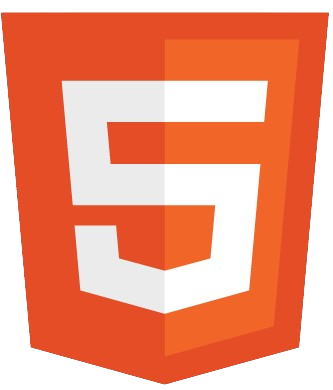
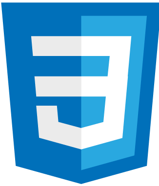
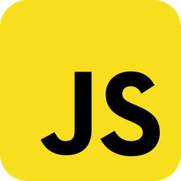

👋 Olá, eu sou o Danillo, ainda não trabalho como programador front-end com carteira assinada, somente free-lancer. 

✍ Estou em busca de uma oportunidade de emprego na área de Front End, onde já me encontro adiantado no curso da EBAC (Escola Britânica de Artes Criativas) - Curso Full Stack Python.
Neste primeiro momento quero me concentrar no front-end, qual será minha porta de entrada no mundo dos DEVS.

🌱 Hoje sou Analista de Sistemas Líder em Suporte na Empresa Litoral Postos na Vertical de Postos de Combustíveis.
Mas trabalho meio período e disponho de tempo para um segundo emprego, e dependendo da oferta, passando a ser o príncipal.

Meu site: https://projeto-less-profile-page.vercel.app/

 <a href="https://github.com/danilloneo">

 
 
 
 
 

